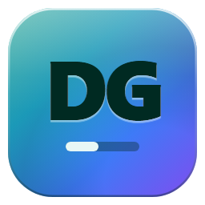
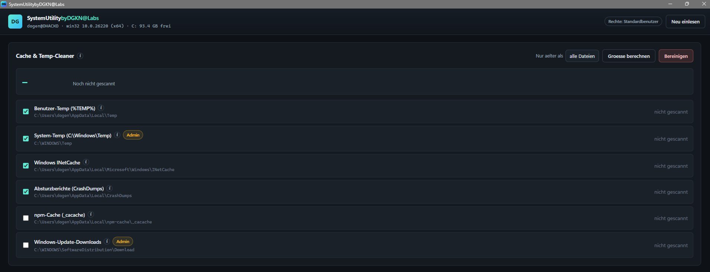
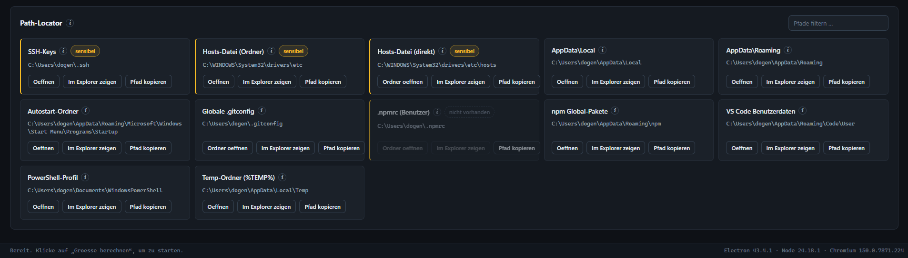
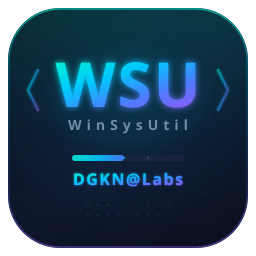

<p align="center">
  
</p>

<h1 align="center">System Utility by DGKN</h1>

<p align="center">
  <strong>Windows-Systemtool zum Aufr&auml;umen und Navigieren &ndash; gebaut mit Electron&nbsp;+&nbsp;TypeScript</strong>
</p>

<p align="center">
  
  
  
  
</p>

---

## Features

| Modul | Beschreibung |
| --- | --- |
| **Temp-Cleaner** | Bereinigt Windows-Temp, User-Temp, Browser-Caches und weitere konfigurierte Ziele mit einem Klick. Zeigt vorher Dateizahl und Groesse an. |
| **Path-Locator** | Listet gaengige Entwicklerpfade (npm, pip, Cargo, Go, Android SDK u.a.) mit Existenz-Check. Oeffnen, Aufdecken oder Kopieren per Knopfdruck. |
| **System-Info** | Laufwerke, freier Speicher und Elevations-Status auf einen Blick. |

### Temp-Cleaner

<p align="center">
  
</p>

### Path-Locator

<p align="center">
  
</p>

---

## Schnellstart

```bash
# Abhaengigkeiten installieren
npm install

# App starten
npm start
```

### Verfuegbare Skripte

| Skript | Wirkung |
| --- | --- |
| `npm run build` | Kompiliert Main, Preload und Renderer nach `dist/` |
| `npm start` | Build + App starten |
| `npm run dev` | Build + App mit DevTools |
| `npm run icon` | Regeneriert `assets/icon.png` und `assets/icon.ico` |
| `npm run typecheck` | Nur Typpruefung |
| `npm run clean` | `dist/` loeschen |
| `npm run dist` | Installer + Portable-EXE bauen (NSIS) |

> Fuer `C:\Windows\Temp` und `SoftwareDistribution\Download` die App als **Administrator** starten.
> Ohne Elevation werden geschuetzte Dateien uebersprungen &ndash; die App bricht nicht ab.

---

## Projektstruktur

```
system-utility-by-dgkn/
├── assets/
│   ├── icon.svg            Vektor-Quelle des Logos
│   ├── icon-small.svg      Variante fuer kleine Groessen
│   ├── icon.png            256x256, generiert
│   └── icon.ico            Multi-Size 16..256, generiert
├── scripts/
│   ├── make-icon.cjs       Rendert Logo → PNG + ICO
│   ├── copy-assets.mjs     Kopiert Renderer-Assets nach dist/
│   └── clean.mjs           Loescht dist/
├── src/
│   ├── main/main.ts        Main-Prozess: Ziele, Allowlist, fs-Walker, IPC
│   ├── preload/preload.ts  ContextBridge
│   ├── renderer/
│   │   ├── index.html      UI-Geruest (strikte CSP)
│   │   ├── styles.css      Dark-Mode-Theme
│   │   ├── renderer.ts     UI-Logik
│   │   ├── splash.html     Splashscreen
│   │   └── splash.css      Splash-Styling
│   └── shared/
│       ├── api.d.ts        Typen fuer alle drei Prozesse
│       └── channels.ts     IPC-Kanalnamen
├── package.json
├── tsconfig.main.json
└── tsconfig.renderer.json
```

---

## Sicherheitsmodell

Die App folgt Electrons Best Practices fuer Prozessisolation:

- **Context Isolation** + **Sandbox** &ndash; kein `nodeIntegration`
- **Strikte CSP** im Renderer (`default-src 'none'`)
- **IPC nur ueber IDs** &ndash; der Renderer sendet niemals rohe Dateipfade
- **Allowlist im Main-Prozess** &ndash; jeder Loeschpfad muss in einem registrierten Ziel liegen
- **Blockliste** fuer kritische Systempfade (`C:\`, `C:\Windows`, `System32`, Benutzerprofil)
- **Symlinks/Junctions** werden nicht verfolgt
- **Bestaetigungsdialog** vor jedem Loeschlauf

---

## Icon & Splashscreen



Das Logo ist eine Verlaufskachel (Teal&nbsp;&rarr;&nbsp;Cyan&nbsp;&rarr;&nbsp;Blau&nbsp;&rarr;&nbsp;Violett) mit dem Monogramm&nbsp;**DG**.
`npm run icon` rendert das SVG in einem Offscreen-BrowserWindow und erzeugt `icon.png` und `icon.ico`.

<br clear="left" />

Beim Start zeigt ein rahmenloser, transparenter Splashscreen Logo und Fortschrittsbalken, bevor das Hauptfenster erscheint. Mindestanzeigedauer: 1100&nbsp;ms; Timeout: 12&nbsp;s.

---

## IPC-Architektur

```
Renderer                Preload (ContextBridge)        Main
────────                ───────────────────────        ────
btn-clean click
  api.cleaner.confirm() → ipcRenderer.invoke        → dialog.showMessageBox
  api.cleaner.clean()   → ipcRenderer.invoke        → sanitizeIds → purgeDirectory
                        ← CleanResult[]              ←
onProgress(cb)          ← ipcRenderer.on             ← webContents.send('op:progress')
```

Vollstaendige Kanaluebersicht: [`src/shared/channels.ts`](src/shared/channels.ts)

---

## Build & Release

```bash
# Installer + Portable-EXE erzeugen
npm run dist

# Nur entpacktes Verzeichnis (schnellerer Test)
npm run dist:dir
```

Ausgabe landet in `release/`. Der NSIS-Installer erlaubt benutzerdefinierte Installationspfade und erstellt Desktop- und Startmenue-Verknuepfungen.

---

## Lizenz

[MIT](LICENSE) &copy; DGKN@Labs
